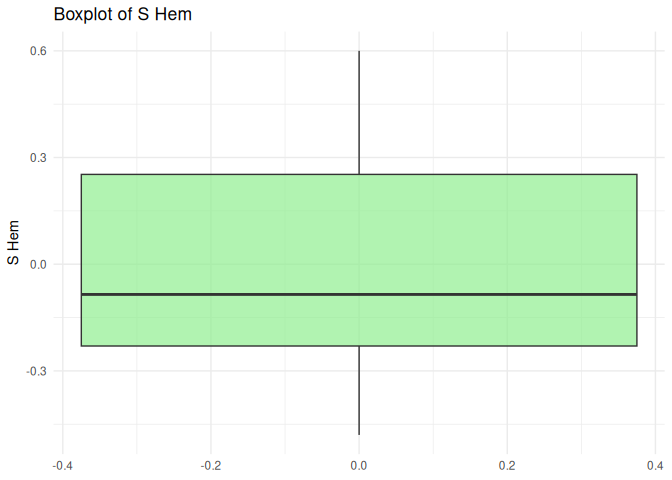

R Notebook for Climate Change Trends
================

Loading the libraries requied to analyze the datasets

``` r
#loading the required packages
library(tidyverse)
```

    ## ── Attaching core tidyverse packages ──────────────────────── tidyverse 2.0.0 ──
    ## ✔ dplyr     1.1.4     ✔ readr     2.1.5
    ## ✔ forcats   1.0.0     ✔ stringr   1.5.1
    ## ✔ ggplot2   3.5.2     ✔ tibble    3.3.0
    ## ✔ lubridate 1.9.4     ✔ tidyr     1.3.1
    ## ✔ purrr     1.1.0     
    ## ── Conflicts ────────────────────────────────────────── tidyverse_conflicts() ──
    ## ✖ dplyr::filter() masks stats::filter()
    ## ✖ dplyr::lag()    masks stats::lag()
    ## ℹ Use the conflicted package (<http://conflicted.r-lib.org/>) to force all conflicts to become errors

``` r
library(corrplot)
```

    ## corrplot 0.95 loaded

``` r
library(VIM)
```

    ## Loading required package: colorspace
    ## Loading required package: grid
    ## VIM is ready to use.
    ## 
    ## Suggestions and bug-reports can be submitted at: https://github.com/statistikat/VIM/issues
    ## 
    ## Attaching package: 'VIM'
    ## 
    ## The following object is masked from 'package:datasets':
    ## 
    ##     sleep

``` r
library(Hmisc)
```

    ## 
    ## Attaching package: 'Hmisc'
    ## 
    ## The following objects are masked from 'package:dplyr':
    ## 
    ##     src, summarize
    ## 
    ## The following objects are masked from 'package:base':
    ## 
    ##     format.pval, units

``` r
library(psych)
```

    ## 
    ## Attaching package: 'psych'
    ## 
    ## The following object is masked from 'package:Hmisc':
    ## 
    ##     describe
    ## 
    ## The following objects are masked from 'package:ggplot2':
    ## 
    ##     %+%, alpha

``` r
library(ggplot2)
library(dplyr)
library(plotly)
```

    ## 
    ## Attaching package: 'plotly'
    ## 
    ## The following object is masked from 'package:Hmisc':
    ## 
    ##     subplot
    ## 
    ## The following object is masked from 'package:ggplot2':
    ## 
    ##     last_plot
    ## 
    ## The following object is masked from 'package:stats':
    ## 
    ##     filter
    ## 
    ## The following object is masked from 'package:graphics':
    ## 
    ##     layout

``` r
library(GGally)
library(mice)
```

    ## 
    ## Attaching package: 'mice'
    ## 
    ## The following object is masked from 'package:stats':
    ## 
    ##     filter
    ## 
    ## The following objects are masked from 'package:base':
    ## 
    ##     cbind, rbind

``` r
library(readr)
library(patchwork)
```

Loading the datasets

``` r
#loading datasets
df1 <- read_csv("global-temp-annual.csv")
```

    ## Rows: 136 Columns: 8
    ## ── Column specification ────────────────────────────────────────────────────────
    ## Delimiter: ","
    ## dbl (8): Year, Land, Land and Ocean, N Hem, S Hem, Band 1, Band 2, Band 3
    ## 
    ## ℹ Use `spec()` to retrieve the full column specification for this data.
    ## ℹ Specify the column types or set `show_col_types = FALSE` to quiet this message.

``` r
df2 <- read_csv("owid-co2-data.csv")
```

    ## Rows: 50191 Columns: 79
    ## ── Column specification ────────────────────────────────────────────────────────
    ## Delimiter: ","
    ## chr  (2): country, iso_code
    ## dbl (77): year, population, gdp, cement_co2, cement_co2_per_capita, co2, co2...
    ## 
    ## ℹ Use `spec()` to retrieve the full column specification for this data.
    ## ℹ Specify the column types or set `show_col_types = FALSE` to quiet this message.

Summary of dataset

``` r
#summary of datasets
cat("Dataset 1 Dimensions:", dim(df1), "\n")
```

    ## Dataset 1 Dimensions: 136 8

``` r
cat("Dataset 2 Dimensions:", dim(df2), "\n")
```

    ## Dataset 2 Dimensions: 50191 79

``` r
cat(strrep("-", 50), "\n")
```

    ## --------------------------------------------------

``` r
cat("Summary of Dataset 1: \n")
```

    ## Summary of Dataset 1:

``` r
summary(df1)
```

    ##       Year           Land          Land and Ocean         N Hem        
    ##  Min.   :1880   Min.   :-0.64000   Min.   :-0.47000   Min.   :-0.5200  
    ##  1st Qu.:1914   1st Qu.:-0.28250   1st Qu.:-0.21000   1st Qu.:-0.2125  
    ##  Median :1948   Median :-0.08000   Median :-0.07500   Median :-0.0150  
    ##  Mean   :1948   Mean   : 0.01243   Mean   : 0.01809   Mean   : 0.0375  
    ##  3rd Qu.:1981   3rd Qu.: 0.22000   3rd Qu.: 0.18250   3rd Qu.: 0.1600  
    ##  Max.   :2015   Max.   : 0.99000   Max.   : 0.86000   Max.   : 1.1200  
    ##                                                                        
    ##      S Hem               Band 1            Band 2             Band 3          
    ##  Min.   :-0.480000   Min.   :-0.5700   Min.   :-0.61000   Min.   :-0.4800000  
    ##  1st Qu.:-0.230000   1st Qu.:-0.1400   1st Qu.:-0.21250   1st Qu.:-0.2625000  
    ##  Median :-0.085000   Median : 0.0700   Median : 0.01500   Median :-0.0750000  
    ##  Mean   :-0.001765   Mean   : 0.1279   Mean   : 0.05216   Mean   :-0.0000862  
    ##  3rd Qu.: 0.252500   3rd Qu.: 0.3425   3rd Qu.: 0.29250   3rd Qu.: 0.2525000  
    ##  Max.   : 0.600000   Max.   : 1.2600   Max.   : 0.91000   Max.   : 0.5800000  
    ##                      NA's   :20        NA's   :20         NA's   :20

``` r
cat(strrep("-", 50), "\n")
```

    ## --------------------------------------------------

``` r
cat("Summary of Dataset 2: \n")
```

    ## Summary of Dataset 2:

``` r
summary(df2)
```

    ##    country               year        iso_code           population       
    ##  Length:50191       Min.   :1750   Length:50191       Min.   :2.150e+02  
    ##  Class :character   1st Qu.:1875   Class :character   1st Qu.:3.273e+05  
    ##  Mode  :character   Median :1924   Mode  :character   Median :2.290e+06  
    ##                     Mean   :1920                      Mean   :5.686e+07  
    ##                     3rd Qu.:1974                      3rd Qu.:9.862e+06  
    ##                     Max.   :2023                      Max.   :8.092e+09  
    ##                                                       NA's   :9172       
    ##       gdp              cement_co2       cement_co2_per_capita
    ##  Min.   :4.998e+07   Min.   :   0.000   Min.   :0.0000       
    ##  1st Qu.:7.874e+09   1st Qu.:   0.000   1st Qu.:0.0000       
    ##  Median :2.744e+10   Median :   0.000   Median :0.0010       
    ##  Mean   :3.300e+11   Mean   :   7.768   Mean   :0.0590       
    ##  3rd Qu.:1.213e+11   3rd Qu.:   0.486   3rd Qu.:0.0757       
    ##  Max.   :1.301e+14   Max.   :1696.308   Max.   :2.4840       
    ##  NA's   :34940       NA's   :21328      NA's   :24833        
    ##       co2            co2_growth_abs      co2_growth_prct     
    ##  Min.   :    0.000   Min.   :-1977.750   Min.   :  -100.000  
    ##  1st Qu.:    0.374   1st Qu.:   -0.005   1st Qu.:    -1.102  
    ##  Median :    4.990   Median :    0.044   Median :     3.804  
    ##  Mean   :  415.698   Mean   :    6.209   Mean   :    43.104  
    ##  3rd Qu.:   53.273   3rd Qu.:    1.002   3rd Qu.:    10.891  
    ##  Max.   :37791.570   Max.   : 1865.208   Max.   :180870.000  
    ##  NA's   :21054       NA's   :23210       NA's   :24189       
    ##  co2_including_luc   co2_including_luc_growth_abs co2_including_luc_growth_prct
    ##  Min.   :  -99.693   Min.   :-2325.500            Min.   :-16151.107           
    ##  1st Qu.:    6.418   1st Qu.:   -0.908            1st Qu.:    -4.412           
    ##  Median :   27.691   Median :    0.078            Median :     0.976           
    ##  Mean   :  535.581   Mean   :    7.215            Mean   :     3.539           
    ##  3rd Qu.:  123.959   3rd Qu.:    2.620            3rd Qu.:     6.297           
    ##  Max.   :41416.480   Max.   : 2340.184            Max.   : 16646.543           
    ##  NA's   :26606       NA's   :26906                NA's   :26906                
    ##  co2_including_luc_per_capita co2_including_luc_per_gdp
    ##  Min.   :-13.907              Min.   : -6.469          
    ##  1st Qu.:  1.974              1st Qu.:  0.392          
    ##  Median :  4.501              Median :  0.869          
    ##  Mean   :  7.223              Mean   :  2.404          
    ##  3rd Qu.:  9.296              3rd Qu.:  2.104          
    ##  Max.   :364.706              Max.   :291.947          
    ##  NA's   :26696                NA's   :33401            
    ##  co2_including_luc_per_unit_energy co2_per_capita     co2_per_gdp    
    ##  Min.   : -8.476                   Min.   :  0.000   Min.   : 0.000  
    ##  1st Qu.:  0.200                   1st Qu.:  0.169   1st Qu.: 0.131  
    ##  Median :  0.277                   Median :  1.013   Median : 0.264  
    ##  Mean   :  1.074                   Mean   :  3.815   Mean   : 0.398  
    ##  3rd Qu.:  0.707                   3rd Qu.:  4.297   3rd Qu.: 0.508  
    ##  Max.   :351.719                   Max.   :782.682   Max.   :82.576  
    ##  NA's   :40490                     NA's   :24009     NA's   :32663   
    ##  co2_per_unit_energy    coal_co2         coal_co2_per_capita consumption_co2   
    ##  Min.   : 0.000      Min.   :    0.000   Min.   : 0.000      Min.   :    0.00  
    ##  1st Qu.: 0.175      1st Qu.:    0.066   1st Qu.: 0.017      1st Qu.:   11.60  
    ##  Median : 0.216      Median :    2.088   Median : 0.224      Median :   71.39  
    ##  Mean   : 0.240      Mean   :  184.120   Mean   : 1.290      Mean   : 1319.19  
    ##  3rd Qu.: 0.256      3rd Qu.:   27.870   3rd Qu.: 1.595      3rd Qu.:  447.41  
    ##  Max.   :10.686      Max.   :15401.220   Max.   :34.260      Max.   :37791.57  
    ##  NA's   :39841       NA's   :28436       NA's   :29141       NA's   :45325     
    ##  consumption_co2_per_capita consumption_co2_per_gdp cumulative_cement_co2
    ##  Min.   : 0.000             Min.   :0.000           Min.   :    0.00     
    ##  1st Qu.: 1.136             1st Qu.:0.206           1st Qu.:    0.00     
    ##  Median : 4.158             Median :0.299           Median :    0.00     
    ##  Mean   : 6.401             Mean   :0.350           Mean   :  188.43     
    ##  3rd Qu.: 9.764             3rd Qu.:0.423           3rd Qu.:    8.94     
    ##  Max.   :63.465             Max.   :3.746           Max.   :48366.29     
    ##  NA's   :45689              NA's   :45747           NA's   :21350        
    ##  cumulative_co2      cumulative_co2_including_luc cumulative_coal_co2
    ##  Min.   :0.000e+00   Min.   :   -532.5            Min.   :     0.00  
    ##  1st Qu.:4.130e+00   1st Qu.:    179.3            1st Qu.:     1.52  
    ##  Median :7.859e+01   Median :   1046.5            Median :    55.89  
    ##  Mean   :1.229e+04   Mean   :  27731.1            Mean   :  9206.57  
    ##  3rd Qu.:1.142e+03   3rd Qu.:   5168.4            3rd Qu.:   905.00  
    ##  Max.   :1.812e+06   Max.   :2627266.5            Max.   :835489.38  
    ##  NA's   :22863       NA's   :26606                NA's   :28436      
    ##  cumulative_flaring_co2 cumulative_gas_co2  cumulative_luc_co2 
    ##  Min.   :    0.000      Min.   :0.000e+00   Min.   : -4470.21  
    ##  1st Qu.:    0.000      1st Qu.:0.000e+00   1st Qu.:    12.67  
    ##  Median :    0.000      Median :1.580e-01   Median :   277.37  
    ##  Mean   :  173.969      Mean   :1.822e+03   Mean   : 10064.59  
    ##  3rd Qu.:    5.971      3rd Qu.:8.329e+01   3rd Qu.:  1810.79  
    ##  Max.   :19795.938      Max.   :2.701e+05   Max.   :819483.25  
    ##  NA's   :34300          NA's   :32177       NA's   :12955      
    ##  cumulative_oil_co2  cumulative_other_co2 energy_per_capita energy_per_gdp  
    ##  Min.   :     0.00   Min.   :    0.000    Min.   :     0    Min.   : 0.078  
    ##  1st Qu.:     0.87   1st Qu.:    0.157    1st Qu.:  3057    1st Qu.: 0.856  
    ##  Median :    23.34   Median :   20.264    Median : 13071    Median : 1.294  
    ##  Mean   :  3708.48   Mean   :  312.842    Mean   : 24784    Mean   : 1.768  
    ##  3rd Qu.:   304.52   3rd Qu.:  124.768    3rd Qu.: 35908    3rd Qu.: 2.139  
    ##  Max.   :628324.25   Max.   :10303.908    Max.   :317577    Max.   :25.253  
    ##  NA's   :24974       NA's   :46989        NA's   :40082     NA's   :42495   
    ##   flaring_co2      flaring_co2_per_capita    gas_co2         gas_co2_per_capita
    ##  Min.   :  0.000   Min.   :  0.000        Min.   :   0.000   Min.   : 0.000    
    ##  1st Qu.:  0.000   1st Qu.:  0.000        1st Qu.:   0.000   1st Qu.: 0.000    
    ##  Median :  0.000   Median :  0.000        Median :   0.015   Median : 0.003    
    ##  Mean   :  5.823   Mean   :  0.274        Mean   :  73.621   Mean   : 0.787    
    ##  3rd Qu.:  0.332   3rd Qu.:  0.031        3rd Qu.:   6.275   3rd Qu.: 0.432    
    ##  Max.   :435.263   Max.   :114.514        Max.   :7922.980   Max.   :53.476    
    ##  NA's   :34239     NA's   :35497          NA's   :32177      NA's   :32899     
    ##  ghg_excluding_lucf_per_capita ghg_per_capita    land_use_change_co2
    ##  Min.   :  0.026               Min.   :-27.601   Min.   :-312.169   
    ##  1st Qu.:  0.291               1st Qu.:  2.048   1st Qu.:   0.028   
    ##  Median :  0.691               Median :  4.291   Median :   3.422   
    ##  Mean   :  3.164               Mean   :  7.730   Mean   : 121.937   
    ##  3rd Qu.:  2.928               3rd Qu.:  9.048   3rd Qu.:  23.295   
    ##  Max.   :369.526               Max.   :369.584   Max.   :7743.690   
    ##  NA's   :14552                 NA's   :14378     NA's   :12955      
    ##  land_use_change_co2_per_capita    methane          methane_per_capita
    ##  Min.   :-28.222                Min.   :    0.000   Min.   :  0.032   
    ##  1st Qu.:  0.130                1st Qu.:    0.465   1st Qu.:  0.655   
    ##  Median :  1.270                Median :    3.720   Median :  1.054   
    ##  Mean   :  4.096                Mean   :  101.812   Mean   :  1.859   
    ##  3rd Qu.:  4.380                3rd Qu.:   20.169   3rd Qu.:  1.777   
    ##  Max.   :238.143                Max.   :10529.812   Max.   :120.192   
    ##  NA's   :13757                  NA's   :12781       NA's   :14378     
    ##  nitrous_oxide      nitrous_oxide_per_capita    oil_co2         
    ##  Min.   :   0.000   Min.   : 0.0000          Min.   :    0.000  
    ##  1st Qu.:   0.072   1st Qu.: 0.1090          1st Qu.:    0.084  
    ##  Median :   0.721   Median : 0.2300          Median :    1.365  
    ##  Mean   :  25.679   Mean   : 0.4669          Mean   :  114.659  
    ##  3rd Qu.:   5.100   3rd Qu.: 0.4750          3rd Qu.:   14.158  
    ##  Max.   :2996.286   Max.   :20.4080          Max.   :12411.968  
    ##  NA's   :11911      NA's   :13871            NA's   :24973      
    ##  oil_co2_per_capita other_co2_per_capita other_industry_co2
    ##  Min.   :  0.0000   Min.   :0.000        Min.   :  0.000   
    ##  1st Qu.:  0.0458   1st Qu.:0.028        1st Qu.:  0.008   
    ##  Median :  0.3990   Median :0.067        Median :  1.352   
    ##  Mean   :  2.1862   Mean   :0.075        Mean   : 14.616   
    ##  3rd Qu.:  1.9952   3rd Qu.:0.104        3rd Qu.:  6.392   
    ##  Max.   :782.6820   Max.   :0.356        Max.   :305.381   
    ##  NA's   :25755      NA's   :47717        NA's   :46989     
    ##  primary_energy_consumption share_global_cement_co2 share_global_co2 
    ##  Min.   :0.000e+00          Min.   :  0.000         Min.   :  0.000  
    ##  1st Qu.:7.586e+00          1st Qu.:  0.000         1st Qu.:  0.004  
    ##  Median :6.764e+01          Median :  0.027         Median :  0.053  
    ##  Mean   :2.493e+03          Mean   :  3.168         Mean   :  5.400  
    ##  3rd Qu.:4.685e+02          3rd Qu.:  0.368         3rd Qu.:  0.578  
    ##  Max.   :1.721e+05          Max.   :100.001         Max.   :100.000  
    ##  NA's   :40040              NA's   :28231           NA's   :22863    
    ##  share_global_co2_including_luc share_global_coal_co2
    ##  Min.   : -0.601                Min.   :  0.000      
    ##  1st Qu.:  0.041                1st Qu.:  0.002      
    ##  Median :  0.179                Median :  0.059      
    ##  Mean   :  3.587                Mean   :  6.825      
    ##  3rd Qu.:  0.870                3rd Qu.:  0.923      
    ##  Max.   :100.000                Max.   :100.000      
    ##  NA's   :26606                  NA's   :28436        
    ##  share_global_cumulative_cement_co2 share_global_cumulative_co2
    ##  Min.   :  0.000                    Min.   :  0.000            
    ##  1st Qu.:  0.000                    1st Qu.:  0.002            
    ##  Median :  0.023                    Median :  0.029            
    ##  Mean   :  3.199                    Mean   :  5.531            
    ##  3rd Qu.:  0.386                    3rd Qu.:  0.403            
    ##  Max.   :100.000                    Max.   :100.000            
    ##  NA's   :28231                      NA's   :22863              
    ##  share_global_cumulative_co2_including_luc share_global_cumulative_coal_co2
    ##  Min.   : -0.120                           Min.   :  0.000                 
    ##  1st Qu.:  0.027                           1st Qu.:  0.001                 
    ##  Median :  0.151                           Median :  0.040                 
    ##  Mean   :  3.469                           Mean   :  7.006                 
    ##  3rd Qu.:  0.721                           3rd Qu.:  0.676                 
    ##  Max.   :100.000                           Max.   :100.000                 
    ##  NA's   :26606                             NA's   :28436                   
    ##  share_global_cumulative_flaring_co2 share_global_cumulative_gas_co2
    ##  Min.   :  0.000                     Min.   :  0.000                
    ##  1st Qu.:  0.000                     1st Qu.:  0.000                
    ##  Median :  0.005                     Median :  0.014                
    ##  Mean   :  3.061                     Mean   :  4.107                
    ##  3rd Qu.:  0.485                     3rd Qu.:  0.314                
    ##  Max.   :100.000                     Max.   :100.000                
    ##  NA's   :39322                       NA's   :35157                  
    ##  share_global_cumulative_luc_co2 share_global_cumulative_oil_co2
    ##  Min.   : -0.5940                Min.   :  0.000                
    ##  1st Qu.:  0.0090                1st Qu.:  0.004                
    ##  Median :  0.1110                Median :  0.058                
    ##  Mean   :  2.7313                Mean   :  3.366                
    ##  3rd Qu.:  0.5572                3rd Qu.:  0.511                
    ##  Max.   :100.0000                Max.   :100.000                
    ##  NA's   :12955                   NA's   :26599                  
    ##  share_global_cumulative_other_co2 share_global_flaring_co2
    ##  Min.   :  0.000                   Min.   :  0.000         
    ##  1st Qu.:  0.159                   1st Qu.:  0.000         
    ##  Median :  0.543                   Median :  0.001         
    ##  Mean   :  7.229                   Mean   :  3.142         
    ##  3rd Qu.:  2.289                   3rd Qu.:  0.674         
    ##  Max.   :100.000                   Max.   :100.000         
    ##  NA's   :48083                     NA's   :39322           
    ##  share_global_gas_co2 share_global_luc_co2 share_global_oil_co2
    ##  Min.   :  0.000      Min.   : -8.182      Min.   :  0.000     
    ##  1st Qu.:  0.000      1st Qu.:  0.001      1st Qu.:  0.006     
    ##  Median :  0.025      Median :  0.076      Median :  0.068     
    ##  Mean   :  4.199      Mean   :  2.605      Mean   :  3.348     
    ##  3rd Qu.:  0.488      3rd Qu.:  0.523      3rd Qu.:  0.546     
    ##  Max.   :100.000      Max.   :100.000      Max.   :100.000     
    ##  NA's   :35157        NA's   :12955        NA's   :26599       
    ##  share_global_other_co2 share_of_temperature_change_from_ghg
    ##  Min.   :  0.000        Min.   : -0.810                     
    ##  1st Qu.:  0.205        1st Qu.:  0.004                     
    ##  Median :  0.838        Median :  0.078                     
    ##  Mean   :  7.513        Mean   :  2.269                     
    ##  3rd Qu.:  3.211        3rd Qu.:  0.359                     
    ##  Max.   :100.000        Max.   :100.000                     
    ##  NA's   :48083          NA's   :9190                        
    ##  temperature_change_from_ch4 temperature_change_from_co2
    ##  Min.   :-0.001              Min.   :0.0000             
    ##  1st Qu.: 0.000              1st Qu.:0.0000             
    ##  Median : 0.000              Median :0.0000             
    ##  Mean   : 0.003              Mean   :0.0077             
    ##  3rd Qu.: 0.001              3rd Qu.:0.0010             
    ##  Max.   : 0.422              Max.   :1.1610             
    ##  NA's   :12131               NA's   :9190               
    ##  temperature_change_from_ghg temperature_change_from_n2o   total_ghg        
    ##  Min.   :-0.001              Min.   :0.0000              Min.   :  -14.961  
    ##  1st Qu.: 0.000              1st Qu.:0.0000              1st Qu.:    1.835  
    ##  Median : 0.000              Median :0.0000              Median :   15.008  
    ##  Mean   : 0.011              Mean   :0.0005              Mean   :  488.542  
    ##  3rd Qu.: 0.001              3rd Qu.:0.0000              3rd Qu.:   78.243  
    ##  Max.   : 1.668              Max.   :0.0850              Max.   :53816.852  
    ##  NA's   :9190                NA's   :12131               NA's   :12781      
    ##  total_ghg_excluding_lucf   trade_co2         trade_co2_share  
    ##  Min.   :    0.000        Min.   :-2195.952   Min.   :-98.849  
    ##  1st Qu.:    0.235        1st Qu.:   -3.180   1st Qu.: -6.168  
    ##  Median :    2.371        Median :    1.518   Median :  8.701  
    ##  Mean   :  316.134        Mean   :   -7.232   Mean   : 20.524  
    ##  3rd Qu.:   29.337        3rd Qu.:    9.153   3rd Qu.: 32.666  
    ##  Max.   :44114.785        Max.   : 1798.999   Max.   :568.635  
    ##  NA's   :12955            NA's   :45656       NA's   :45656

``` r
cat(strrep("-", 50), "\n")
```

    ## --------------------------------------------------

Examining Datasets

``` r
cat("Dataset 1 - First 6 rows:\n")
```

    ## Dataset 1 - First 6 rows:

``` r
head(df1)
```

    ## # A tibble: 6 × 8
    ##    Year  Land `Land and Ocean` `N Hem` `S Hem` `Band 1` `Band 2` `Band 3`
    ##   <dbl> <dbl>            <dbl>   <dbl>   <dbl>    <dbl>    <dbl>    <dbl>
    ## 1  1880 -0.41            -0.2    -0.34   -0.05       NA       NA       NA
    ## 2  1881 -0.39            -0.11   -0.2    -0.02       NA       NA       NA
    ## 3  1882 -0.3             -0.09   -0.18   -0.01       NA       NA       NA
    ## 4  1883 -0.32            -0.2    -0.31   -0.08       NA       NA       NA
    ## 5  1884 -0.6             -0.27   -0.42   -0.12       NA       NA       NA
    ## 6  1885 -0.46            -0.31   -0.41   -0.21       NA       NA       NA

``` r
cat(strrep("-", 50), "\n")
```

    ## --------------------------------------------------

``` r
cat("Dataset 2 - First 6 rows:\n")
```

    ## Dataset 2 - First 6 rows:

``` r
head(df2)
```

    ## # A tibble: 6 × 79
    ##   country  year iso_code population   gdp cement_co2 cement_co2_per_capita   co2
    ##   <chr>   <dbl> <chr>         <dbl> <dbl>      <dbl>                 <dbl> <dbl>
    ## 1 Afghan…  1750 AFG         2802560    NA          0                     0    NA
    ## 2 Afghan…  1751 AFG              NA    NA          0                    NA    NA
    ## 3 Afghan…  1752 AFG              NA    NA          0                    NA    NA
    ## 4 Afghan…  1753 AFG              NA    NA          0                    NA    NA
    ## 5 Afghan…  1754 AFG              NA    NA          0                    NA    NA
    ## 6 Afghan…  1755 AFG              NA    NA          0                    NA    NA
    ## # ℹ 71 more variables: co2_growth_abs <dbl>, co2_growth_prct <dbl>,
    ## #   co2_including_luc <dbl>, co2_including_luc_growth_abs <dbl>,
    ## #   co2_including_luc_growth_prct <dbl>, co2_including_luc_per_capita <dbl>,
    ## #   co2_including_luc_per_gdp <dbl>, co2_including_luc_per_unit_energy <dbl>,
    ## #   co2_per_capita <dbl>, co2_per_gdp <dbl>, co2_per_unit_energy <dbl>,
    ## #   coal_co2 <dbl>, coal_co2_per_capita <dbl>, consumption_co2 <dbl>,
    ## #   consumption_co2_per_capita <dbl>, consumption_co2_per_gdp <dbl>, …

``` r
cat(strrep("-", 50), "\n")
```

    ## --------------------------------------------------

``` r
cat("Dataset 1 data types:\n")
```

    ## Dataset 1 data types:

``` r
sapply(df1, class)
```

    ##           Year           Land Land and Ocean          N Hem          S Hem 
    ##      "numeric"      "numeric"      "numeric"      "numeric"      "numeric" 
    ##         Band 1         Band 2         Band 3 
    ##      "numeric"      "numeric"      "numeric"

``` r
cat(strrep("-", 50), "\n")
```

    ## --------------------------------------------------

``` r
cat("Dataset 2 data types:\n")
```

    ## Dataset 2 data types:

``` r
sapply(df2, class)
```

    ##                                   country 
    ##                               "character" 
    ##                                      year 
    ##                                 "numeric" 
    ##                                  iso_code 
    ##                               "character" 
    ##                                population 
    ##                                 "numeric" 
    ##                                       gdp 
    ##                                 "numeric" 
    ##                                cement_co2 
    ##                                 "numeric" 
    ##                     cement_co2_per_capita 
    ##                                 "numeric" 
    ##                                       co2 
    ##                                 "numeric" 
    ##                            co2_growth_abs 
    ##                                 "numeric" 
    ##                           co2_growth_prct 
    ##                                 "numeric" 
    ##                         co2_including_luc 
    ##                                 "numeric" 
    ##              co2_including_luc_growth_abs 
    ##                                 "numeric" 
    ##             co2_including_luc_growth_prct 
    ##                                 "numeric" 
    ##              co2_including_luc_per_capita 
    ##                                 "numeric" 
    ##                 co2_including_luc_per_gdp 
    ##                                 "numeric" 
    ##         co2_including_luc_per_unit_energy 
    ##                                 "numeric" 
    ##                            co2_per_capita 
    ##                                 "numeric" 
    ##                               co2_per_gdp 
    ##                                 "numeric" 
    ##                       co2_per_unit_energy 
    ##                                 "numeric" 
    ##                                  coal_co2 
    ##                                 "numeric" 
    ##                       coal_co2_per_capita 
    ##                                 "numeric" 
    ##                           consumption_co2 
    ##                                 "numeric" 
    ##                consumption_co2_per_capita 
    ##                                 "numeric" 
    ##                   consumption_co2_per_gdp 
    ##                                 "numeric" 
    ##                     cumulative_cement_co2 
    ##                                 "numeric" 
    ##                            cumulative_co2 
    ##                                 "numeric" 
    ##              cumulative_co2_including_luc 
    ##                                 "numeric" 
    ##                       cumulative_coal_co2 
    ##                                 "numeric" 
    ##                    cumulative_flaring_co2 
    ##                                 "numeric" 
    ##                        cumulative_gas_co2 
    ##                                 "numeric" 
    ##                        cumulative_luc_co2 
    ##                                 "numeric" 
    ##                        cumulative_oil_co2 
    ##                                 "numeric" 
    ##                      cumulative_other_co2 
    ##                                 "numeric" 
    ##                         energy_per_capita 
    ##                                 "numeric" 
    ##                            energy_per_gdp 
    ##                                 "numeric" 
    ##                               flaring_co2 
    ##                                 "numeric" 
    ##                    flaring_co2_per_capita 
    ##                                 "numeric" 
    ##                                   gas_co2 
    ##                                 "numeric" 
    ##                        gas_co2_per_capita 
    ##                                 "numeric" 
    ##             ghg_excluding_lucf_per_capita 
    ##                                 "numeric" 
    ##                            ghg_per_capita 
    ##                                 "numeric" 
    ##                       land_use_change_co2 
    ##                                 "numeric" 
    ##            land_use_change_co2_per_capita 
    ##                                 "numeric" 
    ##                                   methane 
    ##                                 "numeric" 
    ##                        methane_per_capita 
    ##                                 "numeric" 
    ##                             nitrous_oxide 
    ##                                 "numeric" 
    ##                  nitrous_oxide_per_capita 
    ##                                 "numeric" 
    ##                                   oil_co2 
    ##                                 "numeric" 
    ##                        oil_co2_per_capita 
    ##                                 "numeric" 
    ##                      other_co2_per_capita 
    ##                                 "numeric" 
    ##                        other_industry_co2 
    ##                                 "numeric" 
    ##                primary_energy_consumption 
    ##                                 "numeric" 
    ##                   share_global_cement_co2 
    ##                                 "numeric" 
    ##                          share_global_co2 
    ##                                 "numeric" 
    ##            share_global_co2_including_luc 
    ##                                 "numeric" 
    ##                     share_global_coal_co2 
    ##                                 "numeric" 
    ##        share_global_cumulative_cement_co2 
    ##                                 "numeric" 
    ##               share_global_cumulative_co2 
    ##                                 "numeric" 
    ## share_global_cumulative_co2_including_luc 
    ##                                 "numeric" 
    ##          share_global_cumulative_coal_co2 
    ##                                 "numeric" 
    ##       share_global_cumulative_flaring_co2 
    ##                                 "numeric" 
    ##           share_global_cumulative_gas_co2 
    ##                                 "numeric" 
    ##           share_global_cumulative_luc_co2 
    ##                                 "numeric" 
    ##           share_global_cumulative_oil_co2 
    ##                                 "numeric" 
    ##         share_global_cumulative_other_co2 
    ##                                 "numeric" 
    ##                  share_global_flaring_co2 
    ##                                 "numeric" 
    ##                      share_global_gas_co2 
    ##                                 "numeric" 
    ##                      share_global_luc_co2 
    ##                                 "numeric" 
    ##                      share_global_oil_co2 
    ##                                 "numeric" 
    ##                    share_global_other_co2 
    ##                                 "numeric" 
    ##      share_of_temperature_change_from_ghg 
    ##                                 "numeric" 
    ##               temperature_change_from_ch4 
    ##                                 "numeric" 
    ##               temperature_change_from_co2 
    ##                                 "numeric" 
    ##               temperature_change_from_ghg 
    ##                                 "numeric" 
    ##               temperature_change_from_n2o 
    ##                                 "numeric" 
    ##                                 total_ghg 
    ##                                 "numeric" 
    ##                  total_ghg_excluding_lucf 
    ##                                 "numeric" 
    ##                                 trade_co2 
    ##                                 "numeric" 
    ##                           trade_co2_share 
    ##                                 "numeric"

``` r
cat(strrep("-", 50), "\n")
```

    ## --------------------------------------------------

Checking for Missing Values

``` r
#analysing missing values
missing_df1 <- df1 %>%
  summarise_all(~sum(is.na(.))) %>%
  gather(key = "Variable", value = "Missing_Count") %>%
  mutate(
    Missing_Percentage = (Missing_Count / nrow(df1)) * 100,
    Present_Count = nrow(df1) - Missing_Count,
    Present_Percentage = 100 - Missing_Percentage
  ) %>%
  arrange(desc(Missing_Count))

print("Dataset 1 - Missing Values:")
```

    ## [1] "Dataset 1 - Missing Values:"

``` r
print(missing_df1)
```

    ## # A tibble: 8 × 5
    ##   Variable     Missing_Count Missing_Percentage Present_Count Present_Percentage
    ##   <chr>                <int>              <dbl>         <int>              <dbl>
    ## 1 Band 1                  20               14.7           116               85.3
    ## 2 Band 2                  20               14.7           116               85.3
    ## 3 Band 3                  20               14.7           116               85.3
    ## 4 Year                     0                0             136              100  
    ## 5 Land                     0                0             136              100  
    ## 6 Land and Oc…             0                0             136              100  
    ## 7 N Hem                    0                0             136              100  
    ## 8 S Hem                    0                0             136              100

``` r
missing_df2 <- df2 %>%
  summarise_all(~sum(is.na(.))) %>%
  gather(key = "Variable", value = "Missing_Count") %>%
  mutate(
    Missing_Percentage = (Missing_Count / nrow(df2)) * 100,
    Present_Count = nrow(df2) - Missing_Count,
    Present_Percentage = 100 - Missing_Percentage
  ) %>%
  arrange(desc(Missing_Count))

print("Dataset 2 - Missing Values:")
```

    ## [1] "Dataset 2 - Missing Values:"

``` r
print(missing_df2)
```

    ## # A tibble: 79 × 5
    ##    Variable    Missing_Count Missing_Percentage Present_Count Present_Percentage
    ##    <chr>               <int>              <dbl>         <int>              <dbl>
    ##  1 share_glob…         48083               95.8          2108               4.20
    ##  2 share_glob…         48083               95.8          2108               4.20
    ##  3 other_co2_…         47717               95.1          2474               4.93
    ##  4 cumulative…         46989               93.6          3202               6.38
    ##  5 other_indu…         46989               93.6          3202               6.38
    ##  6 consumptio…         45747               91.1          4444               8.85
    ##  7 consumptio…         45689               91.0          4502               8.97
    ##  8 trade_co2           45656               91.0          4535               9.04
    ##  9 trade_co2_…         45656               91.0          4535               9.04
    ## 10 consumptio…         45325               90.3          4866               9.69
    ## # ℹ 69 more rows

``` r
#visualising missing data patterns
p1 <- ggplot(missing_df1, aes(x = reorder(Variable, Missing_Percentage))) +
  geom_col(aes(y = Present_Percentage), fill = "#17becf", alpha = 0.8) +
  geom_col(aes(y = Missing_Percentage), fill = "#ff7f0e", alpha = 0.9) +
  coord_flip() +
  labs(
    title = "Missing Data Pattern - Dataset 1",
    subtitle = "Orange = Missing, Blue = Present",
    x = "Variables",
    y = "Percentage",
    caption = paste("Total observations:", nrow(df1))
  ) +
  theme_minimal() +
  theme(
    plot.title = element_text(size = 14, face = "bold"),
    plot.subtitle = element_text(size = 11, color = "gray60"),
    axis.text = element_text(size = 10),
    panel.grid.minor = element_blank(),
    plot.background = element_rect(fill = "white", color = NA)
  ) +
  scale_y_continuous(labels = function(x) paste0(x, "%"))

print(p1)
```

<!-- -->

``` r
p2<- ggplot(missing_df2, aes(x = reorder(Variable, Missing_Percentage))) +
  geom_col(aes(y = Present_Percentage, text = paste("Variable:", Variable, "<br>Present:", round(Present_Percentage, 1), "%")), 
           fill = "#17becf", alpha = 0.8) +
  geom_col(aes(y = Missing_Percentage, text = paste("Variable:", Variable, "<br>Missing:", round(Missing_Percentage, 1), "%")), 
           fill = "#ff7f0e", alpha = 0.9) +
  coord_flip() +
  labs(title = "Missing Data Pattern - Dataset 2",
       x = "Variables", y = "Percentage") +
  theme_minimal() +
  theme(axis.text.y = element_blank())
```

    ## Warning in geom_col(aes(y = Present_Percentage, text = paste("Variable:", :
    ## Ignoring unknown aesthetics: text

    ## Warning in geom_col(aes(y = Missing_Percentage, text = paste("Variable:", :
    ## Ignoring unknown aesthetics: text

``` r
ggplotly(p2, tooltip = "text")
```

    ## file:////tmp/RtmpFH79uH/filedf6134171626/widgetdf612dc9d7aa.html screenshot completed

<!-- -->

Identifying duplicates and unique values in Data

``` r
cat("Dataset 1 duplicates:", sum(duplicated(df1)), "\n")
```

    ## Dataset 1 duplicates: 0

``` r
cat("Dataset 2 duplicates:", sum(duplicated(df2)), "\n")
```

    ## Dataset 2 duplicates: 0

``` r
cat(strrep("-", 50), "\n")
```

    ## --------------------------------------------------

``` r
check_categorical <- function(df, dataset_name) {
  char_cols <- sapply(df, function(x) is.character(x) | is.factor(x))
  char_col_names <- names(df)[char_cols]
  
  for (col in char_col_names) {
    unique_count <- length(unique(df[[col]]))
    cat(sprintf("%s - %s: %d unique values\n", dataset_name, col, unique_count))
    
    if (unique_count <= 20) {
      print(table(df[[col]], useNA = "ifany"))
      cat("\n")
    }
  }
}

check_categorical(df1, "Dataset 1")
check_categorical(df2, "Dataset 2")
```

    ## Dataset 2 - country: 255 unique values
    ## Dataset 2 - iso_code: 219 unique values

``` r
cat(strrep("-", 50), "\n")
```

    ## --------------------------------------------------

Handling Missing Values

``` r
handle_missing_values <- function(df, strategy = "auto") {
  df_clean <- df

  missing_pct <- df %>%
    summarise_all(~sum(is.na(.)) / length(.) * 100)
  
  #remove columns with >50% missing values
  high_missing_cols <- names(missing_pct)[missing_pct > 50]
  if (length(high_missing_cols) > 0) {
    cat("Removing columns with >50% missing values:", paste(high_missing_cols, collapse = ", "), "\n")
    df_clean <- df_clean %>% select(-all_of(high_missing_cols))
  }
  
  #handling remaining missing values
  for (col in names(df_clean)) {
    if (sum(is.na(df_clean[[col]])) > 0) {
      if (is.numeric(df_clean[[col]])) {
        #using median for numeric columns
        df_clean[[col]][is.na(df_clean[[col]])] <- median(df_clean[[col]], na.rm = TRUE)
      } else {
        #using mode for categorical columns
        mode_val <- names(sort(table(df_clean[[col]]), decreasing = TRUE))[1]
        df_clean[[col]][is.na(df_clean[[col]])] <- mode_val
      }
    }
  }
  
  return(df_clean)
}

df1_clean <- handle_missing_values(df1)
df2_clean <- handle_missing_values(df2)
```

    ## Removing columns with >50% missing values: gdp, co2_including_luc, co2_including_luc_growth_abs, co2_including_luc_growth_prct, co2_including_luc_per_capita, co2_including_luc_per_gdp, co2_including_luc_per_unit_energy, co2_per_gdp, co2_per_unit_energy, coal_co2, coal_co2_per_capita, consumption_co2, consumption_co2_per_capita, consumption_co2_per_gdp, cumulative_co2_including_luc, cumulative_coal_co2, cumulative_flaring_co2, cumulative_gas_co2, cumulative_other_co2, energy_per_capita, energy_per_gdp, flaring_co2, flaring_co2_per_capita, gas_co2, gas_co2_per_capita, oil_co2_per_capita, other_co2_per_capita, other_industry_co2, primary_energy_consumption, share_global_cement_co2, share_global_co2_including_luc, share_global_coal_co2, share_global_cumulative_cement_co2, share_global_cumulative_co2_including_luc, share_global_cumulative_coal_co2, share_global_cumulative_flaring_co2, share_global_cumulative_gas_co2, share_global_cumulative_oil_co2, share_global_cumulative_other_co2, share_global_flaring_co2, share_global_gas_co2, share_global_oil_co2, share_global_other_co2, trade_co2, trade_co2_share

``` r
cat(strrep("-", 50), "\n")
```

    ## --------------------------------------------------

``` r
cat("Dataset 1: Rows", nrow(df1), "->", nrow(df1_clean), "after cleaning\n")
```

    ## Dataset 1: Rows 136 -> 136 after cleaning

``` r
cat(strrep("-", 50), "\n")
```

    ## --------------------------------------------------

``` r
cat("Dataset 2: Rows", nrow(df2), "->", nrow(df2_clean), "after cleaning\n")
```

    ## Dataset 2: Rows 50191 -> 50191 after cleaning

Univariate Analysis

For numeric columns, we will use shapiro.test() to test if the data
follows normal distribution. Upon calculating the p-value:

- If p \> 0.05: Data is likely normally distributed
- If p ≤ 0.05: Data significantly deviates from normal distribution

``` r
create_univariate_plots <- function(df, dataset_name) {
  numeric_cols <- names(df)[sapply(df, is.numeric)]
  categorical_cols <- names(df)[sapply(df, is.factor)]

  for (col in numeric_cols) {
    p1 <- ggplot(df, aes(x = .data[[col]])) +
      geom_histogram(bins = 30, fill = "lightblue", alpha = 0.7) +
      ggtitle(paste("Distribution of", col)) +
      theme_minimal()
    
    p2 <- ggplot(df, aes(y = .data[[col]])) +
      geom_boxplot(fill = "lightgreen", alpha = 0.7) +
      ggtitle(paste("Boxplot of", col)) +
      theme_minimal()

    print(p1)
    print(p2)

    shapiro_test <- shapiro.test(sample(df[[col]], min(5000, length(df[[col]]))))
    cat(sprintf("%s - Shapiro-Wilk normality test p-value: %.6f\n", col, shapiro_test$p.value))
  }

  for (col in categorical_cols) {
    p <- ggplot(df, aes(x = .data[[col]])) +
      geom_bar(fill = "coral", alpha = 0.7) +
      ggtitle(paste("Distribution of", col)) +
      theme_minimal() +
      theme(axis.text.x = element_text(angle = 45, hjust = 1))
    print(p)
  }
}

create_univariate_plots(df1_clean, "Dataset 1")
```

<!-- --><!-- -->

    ## Year - Shapiro-Wilk normality test p-value: 0.000183

<!-- --><!-- -->

    ## Land - Shapiro-Wilk normality test p-value: 0.000005

<!-- --><!-- -->

    ## Land and Ocean - Shapiro-Wilk normality test p-value: 0.000003

<!-- --><!-- -->

    ## N Hem - Shapiro-Wilk normality test p-value: 0.000004

<!-- --><!-- -->

    ## S Hem - Shapiro-Wilk normality test p-value: 0.000002

<!-- --><!-- -->

    ## Band 1 - Shapiro-Wilk normality test p-value: 0.000001

<!-- --><!-- -->

    ## Band 2 - Shapiro-Wilk normality test p-value: 0.032602

<!-- --><!-- -->

    ## Band 3 - Shapiro-Wilk normality test p-value: 0.000054

``` r
create_univariate_plots(df2_clean, "Dataset 2")
```

<!-- --><!-- -->

    ## year - Shapiro-Wilk normality test p-value: 0.000000

<!-- --><!-- -->

    ## population - Shapiro-Wilk normality test p-value: 0.000000

<!-- --><!-- -->

    ## cement_co2 - Shapiro-Wilk normality test p-value: 0.000000

<!-- --><!-- -->

    ## cement_co2_per_capita - Shapiro-Wilk normality test p-value: 0.000000

<!-- --><!-- -->

    ## co2 - Shapiro-Wilk normality test p-value: 0.000000

<!-- --><!-- -->

    ## co2_growth_abs - Shapiro-Wilk normality test p-value: 0.000000

<!-- --><!-- -->

    ## co2_growth_prct - Shapiro-Wilk normality test p-value: 0.000000

<!-- --><!-- -->

    ## co2_per_capita - Shapiro-Wilk normality test p-value: 0.000000

<!-- --><!-- -->

    ## cumulative_cement_co2 - Shapiro-Wilk normality test p-value: 0.000000

<!-- --><!-- -->

    ## cumulative_co2 - Shapiro-Wilk normality test p-value: 0.000000

<!-- --><!-- -->

    ## cumulative_luc_co2 - Shapiro-Wilk normality test p-value: 0.000000

<!-- --><!-- -->

    ## cumulative_oil_co2 - Shapiro-Wilk normality test p-value: 0.000000

<!-- --><!-- -->

    ## ghg_excluding_lucf_per_capita - Shapiro-Wilk normality test p-value: 0.000000

<!-- --><!-- -->

    ## ghg_per_capita - Shapiro-Wilk normality test p-value: 0.000000

<!-- --><!-- -->

    ## land_use_change_co2 - Shapiro-Wilk normality test p-value: 0.000000

<!-- --><!-- -->

    ## land_use_change_co2_per_capita - Shapiro-Wilk normality test p-value: 0.000000

<!-- --><!-- -->

    ## methane - Shapiro-Wilk normality test p-value: 0.000000

<!-- --><!-- -->

    ## methane_per_capita - Shapiro-Wilk normality test p-value: 0.000000

<!-- --><!-- -->

    ## nitrous_oxide - Shapiro-Wilk normality test p-value: 0.000000

<!-- --><!-- -->

    ## nitrous_oxide_per_capita - Shapiro-Wilk normality test p-value: 0.000000

<!-- --><!-- -->

    ## oil_co2 - Shapiro-Wilk normality test p-value: 0.000000

<!-- --><!-- -->

    ## share_global_co2 - Shapiro-Wilk normality test p-value: 0.000000

<!-- --><!-- -->

    ## share_global_cumulative_co2 - Shapiro-Wilk normality test p-value: 0.000000

<!-- --><!-- -->

    ## share_global_cumulative_luc_co2 - Shapiro-Wilk normality test p-value: 0.000000

<!-- --><!-- -->

    ## share_global_luc_co2 - Shapiro-Wilk normality test p-value: 0.000000

<!-- --><!-- -->

    ## share_of_temperature_change_from_ghg - Shapiro-Wilk normality test p-value: 0.000000

<!-- --><!-- -->

    ## temperature_change_from_ch4 - Shapiro-Wilk normality test p-value: 0.000000

<!-- --><!-- -->

    ## temperature_change_from_co2 - Shapiro-Wilk normality test p-value: 0.000000

<!-- --><!-- -->

    ## temperature_change_from_ghg - Shapiro-Wilk normality test p-value: 0.000000

<!-- --><!-- -->

    ## temperature_change_from_n2o - Shapiro-Wilk normality test p-value: 0.000000

<!-- --><!-- -->

    ## total_ghg - Shapiro-Wilk normality test p-value: 0.000000

<!-- --><!-- -->

    ## total_ghg_excluding_lucf - Shapiro-Wilk normality test p-value: 0.000000
